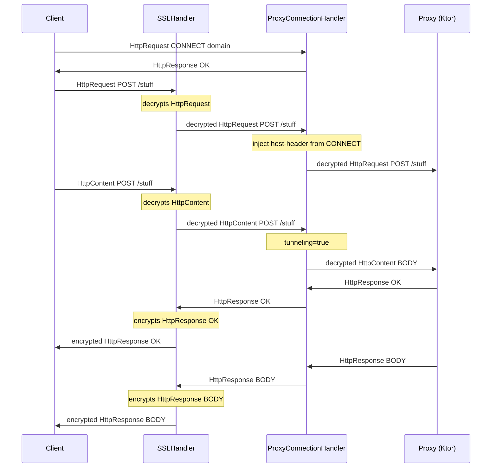
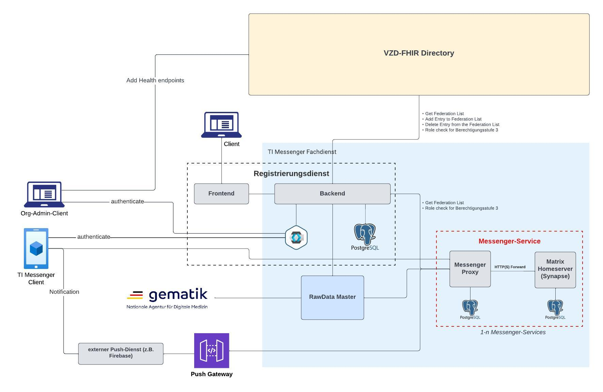

# TIM Referenzimplementierung - Messenger Proxy

This project contains the `TIM reference implementation` of a `Messenger Service` instance. It is based on the following
technologies:

* `Ktor`
* `Koin Dependency Management`
* `Trixnity Matrix Framework`
* `PostgreSQL`
* JDK 21
  * [SDKMAN](https://sdkman.io) is recommended
    * use `sdk env install` to install this version
    * use `sdk env` to switch to this version

## How the forward proxy works



## Usage

1. Optional: To be able to fetch the `federation list` from the `registration service` first start the latter one
   with `docker compose` in the dedicated `registration service` project.
   Please refer to the documentation (`README.md`) there to see how to establish a connection to the VZD FHIR directory
   and fetch the `federation list` in the first place.
2. Update your `hosts` file with the following entry: `127.0.0.1 host.docker.internal`
   1. Linux and Mac: `/etc/hosts`
   2. Windows: `C:\Windows\System32\Drivers\etc\hosts`
3. Use the [CA configuration file](certificates/ca.conf) to create x509 certificates:

   ```shell
   cd certificates
   openssl ecparam -name prime256v1 -genkey -noout -out ca.key
   openssl req -new -x509 -days 3650 -config ca.conf -key ca.key -out ca.crt
   cat ca.key > key.pem
   cat ca.crt >> key.pem
   ```
4. Create a docker network with the name `timref-network` if it not already exists

   ```shell
   docker network create timref-network
   ```
5. The application should be built at least once because the build artifact is used to create the docker image. This can be done like so:
    ```shell
    ./mvnw clean install
    ```
   
6. The components of this project can be started by using

   ```shell
   docker compose build
   docker compose up
   ```

7. (Only possible if you did step 1) To test if a connection from the `messenger proxy` to the `registration service` could be established, run the following commands in your terminal:
   ```shell
   docker exec -it messenger_proxy_synapse bash
   ```
   After that run this command inside the bash of the container:
   ```shell
   curl backend:8080
   ``` 
   The answer should be a html string containing "HTTP Status 404 – Not Found".

---
**HINT**

In the local environment there is no Prometheus client.

---

## Development
### Start the `messenger proxy` locally

For development purposes it might be better to start the `messenger proxy` not using `docker compose` but locally.

---
**ATTENTION**

Please note that the `messenger proxy` run from `docker compose` must be stopped in that case to prevent port conflicts.

---

To run the application use the IntelliJ Idea [Run Configuration called Messenger Proxy](.run/Messenger%20Proxy.run.xml)
can be used.
If you cannot use the predefined Run Configuration and want to start the application via the terminal, you must set a
local environment variable ```CONFIGURATION_FILE_PATH``` with the value "src/main/resources/application-local.yml".

### Dependencies

For a list of dependencies for the proxy see here [pom.xml](pom.xml). They are list in the section `dependencies`.
Alternatively you can use the following command:
```shell
$ ./mvnw dependency:tree
```

### Standard Ports

| Port Number | Port Number Docker Internal | Description                 | Credentials |
|-------------|-----------------------------|-----------------------------|-------------|
| 8090        | 8090                        | Messenger Proxy Inbound     |             |
| 8093        | 8093                        | Messenger Proxy Outbound    |             |
| 1233        | 1233                        | Messenger Proxy Healthcheck |             |
| 5433        | 5432                        | Messenger Proxy DB          | messenger-proxy:password |
| 8083        | 8083                        | Synapse                     | admin:admin |
| 5434        | 5432                        | Synapse DB                  | synapse:synapsepassword |

### Probes
The health and readiness of this service can be obtained at the following endpoints:

- `GET :1233/actuator/health/liveness`
- `GET :1233/actuator/health/readiness`

`liveness` includes health states of the following components:

- `inboundProxy`
- `outboundProxy`

`readiness` includes health states of the following components:

- `database`
- `synapse`
- `registration-service`

## Configuration of local Matrix home server (Synapse)

### Admin Nutzer

At startup, an admin user is automatically created with the credentials from
the [docker-compose.yml](docker-compose.yml) `admin:admin`.

### Connection on local network

To be able to access the home server from the local network (e.g. from a client) the parameter `server_name` must be set in the [homeserver.yaml](synapse/config/local/homeserver.yaml) to the local IP address.

## Tests with Maven
1. Install `Maven` on your local system (https://maven.apache.org).
2. Before running the tests be sure that no port conflicts can arise caused by other applications.
   This also includes the `Messenger Proxy` itself.
3. Generally, the tests can be run with the following command. There are unit and integrations test executed.

```shell
$ ./mvnw clean verify
```

## License Report
In order to create a license report simply run the following command inside the project root directory. This command is tested with `zsh` but should work in `bash` also:

```bash
$ ./mvnw license:third-party-report
```

The generated license report can then be found at `$PROJECT_DIR/target/site/third-party-report.html`.

## Architecture Overview

### Fixing Matrix v1.11
The specification of the TIM reference implementation stipulates that no higher version of the matrix protocol than v1.11 may be used. 
As the Matrix version cannot be configured in Synapse, the following steps were taken in the `Messenger Proxy to determine this:

1. The `Messenger Proxy` only forwards requests that are specified in then specification of Matrix v1.11.
The checks are carried out using the path in the calling URL.

2. For the request to `/_matrix/client/versions`, 
the `Messenger Proxy` processes the Synapse response so that only version tags <= v1.11 are returned.

### well known support information
Request to `/.well-known/matrix/support` are forwarded to `/backend/well-known-support/[serverName]` endpoint of the 
`registration service`, where `serverName` reflects to the actual homeserver hostname.
To be able to test the functionality, start the `registration_service` with `docker compose` in the dedicated project. 
Make sure the `serverName` exists in the database and configure the support information to your needs. You can specify 
the serverName by setting `logInfoConfig.homeFQDN` in [resources](src/main/resources/app/resources/application-local-docker.yml)

### ways of communication
1. Connection to registration service
2. Connection to the homeserver (Synapse)
3. Requests toward the rawdata gathering service (`rawdata master`)


